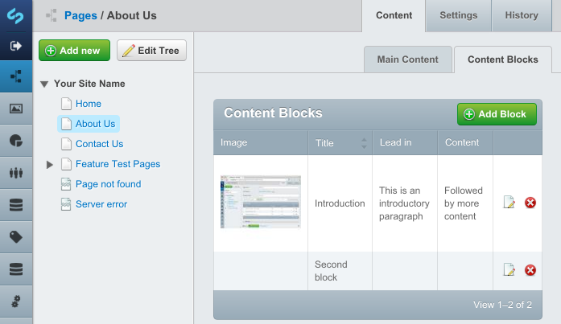
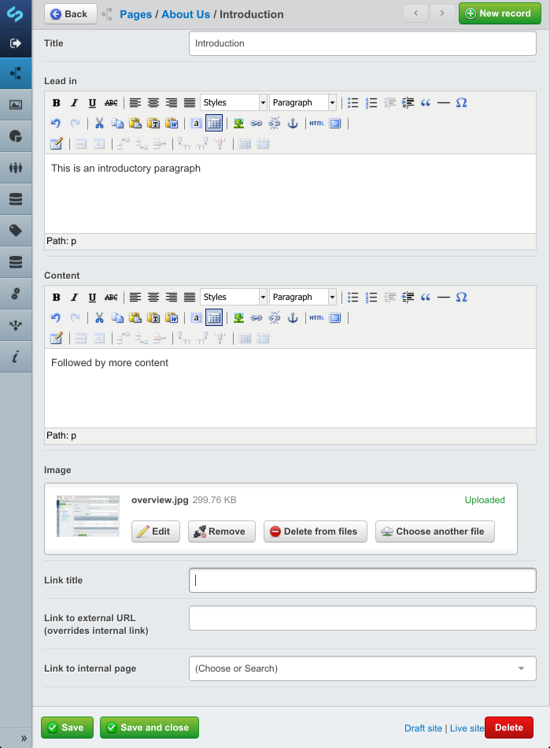

# Blocks SilverStripe module

Blocks is a generic class which can be used to build small content blocks which can be associated globally or with a specific page.

## Requirements

* SilverStripe 3.1

## Installation

Drop the module into your SilverStripe project and run /dev/build

## Upgrade

If upgrading from a previous version of Blocks, you will need to make a few adjustments in your code. Blocks now uses standard `private static $db` instead of `protected $_datafields`:

	// Example before:
	protected $_datafields = array(
		'FeedURL'          => 'TextField',
		'Results'          => 'NumericField',
		'SummaryMaxLength' => 'NumericField',
		'CacheTime'        => 'NumericField',
		'Striptags'        => 'CheckboxField',
		'Modifier'         => 'DropdownField',
	);

	// Example after:
	private static $db = array(
		'FeedURL'          => 'Text',
		'Results'          => 'Int',
		'SummaryMaxLength' => 'Int',
		'CacheTime'        => 'Int',
		'Striptags'        => 'Int',
		'Modifier'         => 'Text',
	);

You also have to add the fields to your model in `getCMSFields()`.

	function getCMSFields() {
		// Before:
		foreach($this->_datafields as $fieldname => $fieldclass) {
			if($fieldname != 'Modifier') { // Add field by hand later
				$fields->push(new $fieldclass($fieldname, Block::getDataFieldLabel(__CLASS__, $fieldname)));
			}
		}

		// After:
		$fields->push(new TextField('FeedURL', 'FeedURL'));
		$fields->push(new NumericField('Results', 'Results'));
		$fields->push(new NumericField('SummaryMaxLength', 'SummaryMaxLength'));
		$fields->push(new NumericField('CacheTime', 'CacheTime'));
		$fields->push(new CheckboxField('Striptags', 'Striptags'));
	}

This release of Blocks is backwards-compatible with the old method and will still read data from `Block->Data` if no data is present in
the regular $db fields. Once a block has been saved in the new version of Blocks, the data will be read from the $db fields instead.

Finally you need to run `/dev/build` after upgrading (and of course after updating your code if necessary).

## Optional dependencies

The following plugins are used if they are available in your project:

* [optionaltreedropdownfield](https://github.com/richardsjoqvist/silverstripe-optionaltreedropdownfield)
* [SortableGridField](https://github.com/UndefinedOffset/SortableGridField)

## Usage

### Implementation

Blocks needs to be extended to work well. Create a php-file in /mysite/code and call it something like
`ContentBlock.php`. Add the following code to the file:

	class ContentBlock extends Block
	{
	}

Next you need to set up a relationship for the newly created class, for example in `Page.php`:

	private static $has_many = array(
		'ContentBlocks'	=> 'ContentBlock',
	);

Run /dev/build to register the new class and relationship.
Finally add a manager (pre-defined GridField) for the ContentBlock class in getCmsFields():

	class Page extends SiteTree
	{
		function getCMSFields()
		{
			$fields = parent::getCMSFields();
			//                                 Tab              Manager     Source Class        Title             DataList
			//                                  |                  |             |                |                   |
			$fields->addFieldToTab('Root.ContentBlocks', new Block_Manager('ContentBlock', 'Content Blocks', $this->ContentBlocks()) );
			return $fields;
		}
	}

Repeat the steps above to create another class, like `BannerBlock` to create another type of block. There is no limit on
how many types of blocks a site can have.

### Customizing extended blocks

Extended blocks can be customized just like any other type of DataObject exteded class, for example:

	class ContentBlock extends Block
	{
		private static $db = array(
			'SomeText'		=> 'Text',
			'AnInt'			=> 'Int',
		);

		function getCMSFields()
		{
			$fields = parent::getCMSFields();
			$fields->push(new TextField('SomeText', 'Some text'));
			$fields->push(new CheckboxField('AnInt', 'Check me out'));
			$fields->removeByName('Content');
			return $fields;
		}
	}

### Templating 

Blocks connected to a page can be displayed in a template using a loop:

	<% loop ContentBlocks %>
		$Title
		$LeadIn
		$Content
		$Image.SetWidth(150)
		<% if HasLink %>
			<a href="$LinkURL" <% if LinkIsExternal %>class="external"<% end_if%>>$LinkTitle</a>
		<% end_if %>
	<% end_loop %>

### Inheritance

You may want to create global blocks or inherit blocks from other pages. In such case you can create a function in the
Page_Controller class that allows more granular control over which ContentBlocks are returned to the loop:

	class Page_Controller extends ContentController
	{
		function ContentBlocks($limit=0)
		{
			// Get blocks for current page
			$blocks = ContentBlock::get()
				->filter(array('PageID' => $this->dataRecord->ID))
				->sort('SortOrder', 'ASC')
				->limit((int)$limit);
			if($blocks->Count()) return $blocks;
			// No blocks exists for current page, inherit from home page
			if(class_exists('HomePage')) {
				if(class_exists('Translatable')) {
					$HomePage = Translatable::get_one_by_locale('HomePage', Translatable::get_current_locale());
				} else {
					$HomePage = DataObject::get_one('HomePage');
				}
				if($HomePage) {
					$blocks = ContentBlock::get()
						->filter(array('PageID' => $HomePage->ID))
						->sort('SortOrder', 'ASC')
						->limit((int)$limit);
					if($blocks->Count()) return $blocks;
				}
			}
			return null;
		}
	}

This function returns the ContentBlocks for the current page, but if the current page does not have any ContentBlocks it
moves on to the HomePage and returns any ContentBlocks from there instead.

## Included pre-defined models

The module includes a few models which can be used out of the box (or exteded) for specific purposes:

* [ContactBlock](#contact_block) - for adding contacts to a page
* [FeedBlock](#feed_block) - for adding rss feeds to a page
* [LinkBlock](#link_block) - to add a collection of links to a page

## ContactBlock 

This model can be used to add contacts to a page. To use it you need to define a relationship in `Page.php`:

	private static $has_many = array(
		'Contacts'	=> 'ContactBlock',
	);

Run /dev/build to register the relationship and then add a manager for the ContactBlock class in getCmsFields():

	class Page extends SiteTree
	{
		function getCMSFields()
		{
			$fields = parent::getCMSFields();
			//                             Tab              Manager    Source Class     Title        DataList
			//                              |                  |            |             |              |
			$fields->addFieldToTab('Root.Contacts', new Block_Manager('ContactBlock', 'Contacts', $this->Contacts()) );
			return $fields;
		}
	}

Contacts can be added to template output like any other block (see [Templating](#templating)).
The extra fields that can be printed separately are:

* Title: Name of the contact
* Role: Role (job title)
* Email: E-mail address
* Phone: Phone number
* Mobile: Mobile phone number
* Street: Address
* Zip: Zipcode
* City: City
* Box: PO Box
* Image: Photo of the contact

## FeedBlock 

This model can be used to add RSS feeds to a page. To use it you need to define a relationship in `Page.php`:

	private static $has_many = array(
		'RssFeeds'	=> 'FeedBlock',
	);

Run /dev/build to register the relationship and then add a manager for the FeedBlock class in getCmsFields():

	class Page extends SiteTree
	{
		function getCMSFields()
		{
			$fields = parent::getCMSFields();
			//                              Tab                  Manager   Source Class    Title          DataList
			//                               |                      |           |            |                |
			$fields->addFieldToTab('Root.RssFeeds', new FeedBlock_Manager('FeedBlock', 'Blog Feeds', $this->RssFeeds()) );
			return $fields;
		}
	}

Feeds can be added to template output like any other block (see [FeedBlock templating](#feed_block_templating)).
The extra fields that can be printed separately are:

* FeedURL: URL to feed
* URL: Link URL (for block, not per item)
* IsExternal: True if block link is external
* IsInternal: True if block link is internal
* Image: Image
* Items: The entries in the feed

Additionally, each entry in the feed has the following fields that can be printed separately:

* Title: Title
* Summary: Shortened description (100 chars)
* Description: Description (text)
* Date: Date (SS_DateTime object)
* Link: Link to original entry

### FeedBlock templating 

Since feed blocks have another dimension in that each feed contains a number of entries, the template needs to have
a nested loop in order to display the items as well as the feeds:

	<% loop RssFeeds %>
		<!-- Check if feed has any items -->
		<% if Items %>
		

			$Image.SetWidth(50)
			<% if URL %>
				<a href="$URL" <% if IsExternal %>class="external"<% end_if%>>$Title</a>
			<% else %>
				<strong>$Title</strong>
			<% end_if %>
			 
			Feed Source: <a href="$FeedURL" class="external">$FeedURL</a> 
			<!-- Iterate over each item in feed -->
			<% loop Items %>
				<a href="$Link" class="external">$Title</a> 
				$Date.Format(Y-m-d H:i:s) 
				$Description 
				 
			<% end_loop %>
		

		<% end_if %>
	<% end_loop %>

### Global feeds

In some cases you may want to create global feeds for an entire site. For example, you may wish to define feeds on the
home page and let every other page inherit those feeds. In that case you can create a function in the Page_Controller
class that controls which feeds are returned to the loop:

	class Page_Controller extends ContentController
	{
		function RssFeeds($limit=0)
		{
			// Get all items from custom RssFeed class which extends FeedBlock:
			if(class_exists('HomePage')) {
				if(class_exists('Translatable')) {
					$HomePage = Translatable::get_one_by_locale('HomePage', Translatable::get_current_locale());
				} else {
					$HomePage = DataObject::get_one('HomePage');
				}
				if($HomePage) {
					$blocks = ContentBlock::get()
						->filter(array('PageID' => $HomePage->ID))
						->sort('SortOrder', 'ASC')
						->limit((int)$limit);
					if($blocks->Count()) return $blocks;
				}
			}
			return null;
		}
	}

This function gets all items from a class called RssFeed which extends FeedBlock.

### Modifying feed items

FeedBlock allows you to create modifier functions to run entries through before displaying them on a page. To specify
which methods are available as modifiers you need to extend FeedBlock and create the functions you need.

Example: `RssFeed.php` (place it in the same directory as `Page.php`, register the relationship and run /dev/build)

	class RssFeed extends FeedBlock
	{

		/**
		 * Define which functions are available as modifiers
		 */
		protected $modifier_functions = array(
			'MyFunction',
			'MyOtherFunction',
		);

		/**
		 * Modify feed results
		 * @param DataObject $entry
		 */
		function MyFunction($entry)
		{
			// Remove images from entry
			$entry->description = preg_replace("/(]*)(>)/isU", '', $entry->description);
		}

		/**
		 * Modify feed results
		 * @param DataObject $entry
		 */
		function MyOtherFunction($entry)
		{
			// Remove links from entry
			$entry->description = preg_replace("/(<a )([^>]*)(>)/isU", '', $entry->description);
			$entry->description = str_replace('</a>', '', $entry->description);
		}

	}

When editing a RssFeed item in a manager, one of the specified modifier functions can be selected for the entries
in that feed. Each item is then passed to the selected modified function before it's displayed on the page.

## LinkBlock 

This model can be used to add a collection of links to a page. To use it you need to define a relationship in `Page.php`:

	private static $has_many = array(
		'Links'	=> 'LinkBlock',
	);

Run /dev/build to register the relationship and then add a manager for the LinkBlock class in getCmsFields():

	class Page extends SiteTree
	{
		function getCMSFields()
		{
			$fields = parent::getCMSFields();
			//                            Tab            Manager   Source Class  Title   DataList items
			//                             |                |           |          |           |
			$fields->addFieldToTab('Root.Links', new Block_Manager('LinkBlock', 'Links', $this->Links()) );
			return $fields;
		}
	}

Links can be added to template output like any other block (see [Templating](#templating)).
The extra fields that can be printed separately are:

* Title: Link title
* URL: Link URL
* IsExternal: True if link is external
* IsInternal: True if link is internal
* Attributes: Custom attributes to add to a-tag
* CssClasses: Classnames to add to &lt;a&gt;-tag
* Image: Image

## Screenshots

